# Introcuction

I'm a big proponent of delegated authentication. It's no surprise that [Broken Authentication](https://www.owasp.org/index.php/Top_10-2017_A2-Broken_Authentication) is #2 at the OWASP top 10 latest report. It's been #2 for a very long time, which means that developers and enterprises are still getting this wrong. There are so many ways that authentication that can go wrong, that delegated authentication should be the preferred and possibly the default choice for all platforms. There are many different services that can provide this. I've heavily worked with Azure AD and Azure AD B2C but this time I wanted to take [Auth0](https://auth0.com/) for a spin. In this post I'll show you how to implement authentication and authorization with Auth0 to secure an ASP.NET Core web application and then extend the authentication mechanism to secure access to a back-end web api. 

Auth0 is an Identity Provider service (among many other things) which allows you to decouple the authentication and authorisastion process from your application. Like Azure AD (B2C) and IdentityServer, the idea behind the delegated authentication is that you, as a developer and, in extension, as a company, don't have to worry about how to implement this functionality **properly**. By properly I mean in a secure and scalable manner that meets demand as your application grows. Auth0 takes care of these hard requirements while we can focus on the rest of the application.

The implementation below makes use of Role-based authorisation using custom Roles to secure access to various parts of the application.

## 1. Getting a copy of the project

To grab a copy of the sample code, you can download the zip or clone it locally:

`git clone https://github.com/cmatskas/auth0demo.git`

## 2. Create the Auth0 application

**Prerequisites**

- An Auth0 account
- .NET Core SDK
- Visual Studio 2017 15.3 or Visual Studio Code

To allow our ASP.NET Core application to integrate with Auth0, we need an Auth0 application. The instructions on how to set this up can be found [here](https://auth0.com/docs/quickstart/webapp/aspnet-core/v2/00-intro). However, I've added a quick guide here as well to save you some time.

On your Auth0 **Dashboard**, click on **Clients** and then click on the *Big Red Button* to **+Create New Client**. On the modal window, choose a meaningful name for your app and then, since we're working with ASP.NET Core, choose **Regular Web Application** as per the image below:

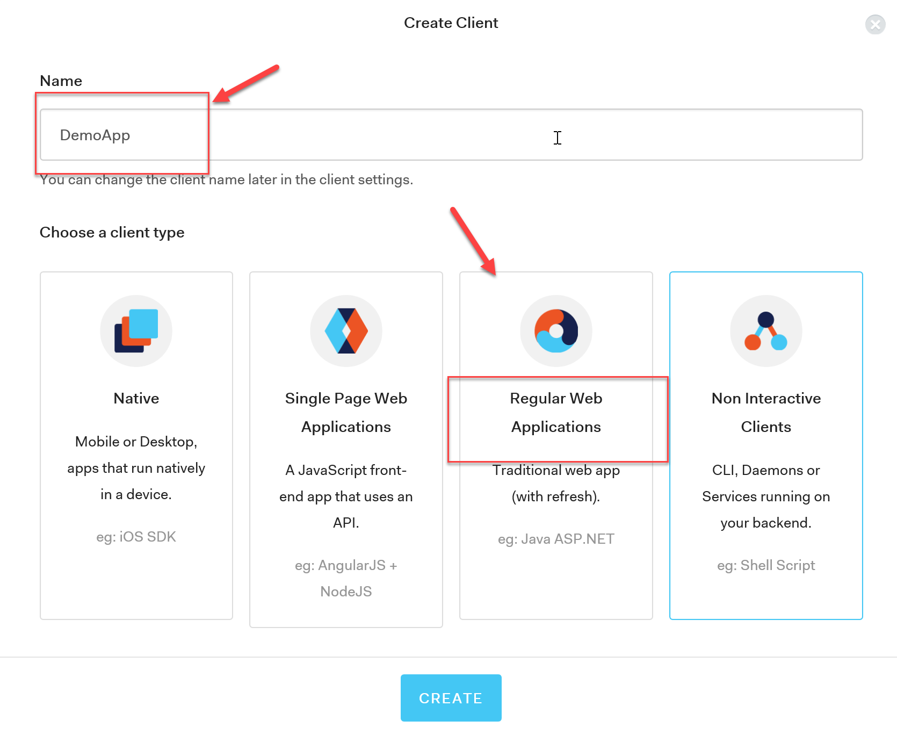

Once the application is created, skip the quick start and go to the **Settings Tab** which contains the information you need in order to configure your ASP.NET Core application:

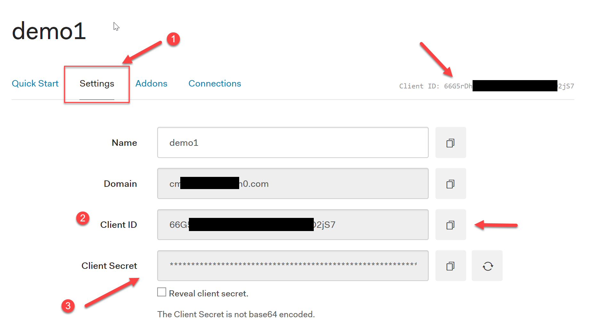

You can follow the Auth0 walkthrough that explains what you need to do to [setup your application](https://auth0.com/docs/quickstart/webapp/aspnet-core#get-your-application-keys) (in Auth0 terminology: Application == Client) and how to [get your Auth0 client keys](https://auth0.com/docs/quickstart/webapp/aspnet-core#get-your-application-keys). Finally, since this application will need to access an API, we also need to [configure the JWT token](https://auth0.com/docs/quickstart/webapp/aspnet-core#configure-json-web-token-signature-algorithm) (i.e. the access token for authenticating in the API) 

## 3. Edit the project with your settings
At this point I assume you have both a .NET Core Web App and a .NET Core Web API or that you've cloned the project from Step #1. With the Auth0 settings in place, we can now edit our web application's `appsettings.json` to add the Auth0 configuration settings. Open the file and populate the values below:

```
"Auth0": {
    "Domain": "{yourAuth0domainname}.eu.auth0.com",
    "ClientId": "{your Auth0 Client ID}",
    "ClientSecret": "{your Auth0 Client Secret}",
    "CallbackUrl": "http://localhost:1102/signin-auth0"
} 
```

> WARNING: You should avoid storing sensitive information like ClientSecret, API Keys etc in your `appsettings.json` because they are stored in **clear text**. You should use a service like [Azure KeyVault](https://cmatskas.com/securing-asp-net-core-application-settings-using-azure-key-vault/) to store and retrieve this data as needed. More info on using KeyVault can be found [here](https://docs.microsoft.com/en-us/azure/key-vault/key-vault-whatis). 

## 4. Add the Authentiction middleware

The setup for Auth0 is fairly straightforward. Comparing this to the Azure AD integration process, I found that Auth0 is much easier to work with. The code that adds the authentication middleware is provided below. The code needs to be added to the `Startup.cs` class:

```
public void ConfigureServices(IServiceCollection services)
{
    services.AddAuthentication(options =>
    {
        options.DefaultAuthenticateScheme = CookieAuthenticationDefaults.AuthenticationScheme;
        options.DefaultSignInScheme = CookieAuthenticationDefaults.AuthenticationScheme;
        options.DefaultChallengeScheme = CookieAuthenticationDefaults.AuthenticationScheme;
    })
    .AddCookie()
    .AddOpenIdConnect("Auth0", options =>
    {
        // Set the authority to your Auth0 domain
        options.Authority = $"https://{Configuration["Auth0:Domain"]}";

        // Configure the Auth0 Client ID and Client Secret
        options.ClientId = Configuration["Auth0:ClientId"];
        options.ClientSecret = Configuration["Auth0:ClientSecret"];

        options.ResponseType = "code";

        options.Scope.Clear();
        options.Scope.Add("openid");
        options.Scope.Add("profile");

        options.SaveTokens = true;
        options.CallbackPath = new PathString("/signin-auth0");
        options.ClaimsIssuer = "Auth0";

        options.TokenValidationParameters = new TokenValidationParameters
        {
            NameClaimType = "name",
            RoleClaimType = "http://schemas.microsoft.com/ws/2008/06/identity/claims/roles"
        };

        options.Events = new OpenIdConnectEvents
        {
            OnRedirectToIdentityProvider = context =>
            {
                context.ProtocolMessage.SetParameter("audience", @"http://auth0demoApi");
                return Task.FromResult(0);
            },
            // handle the logout redirection 
            OnRedirectToIdentityProviderForSignOut = (context) =>
            {
                var logoutUri = $"https://{Configuration["Auth0:Domain"]}/v2/logout?client_id={Configuration["Auth0:ClientId"]}";

                var postLogoutUri = context.Properties.RedirectUri;
                if (!string.IsNullOrEmpty(postLogoutUri))
                {
                    if (postLogoutUri.StartsWith("/"))
                    {
                        var request = context.Request;
                        postLogoutUri = $"{request.Scheme}://{request.Host}{request.PathBase}{postLogoutUri}";
                    }
                    logoutUri += $"&returnTo={Uri.EscapeDataString(postLogoutUri)}";
                }

                context.Response.Redirect(logoutUri);
                context.HandleResponse();

                return Task.CompletedTask;
            }
        };
    });

    services.AddMvc();
}

public void Configure(IApplicationBuilder app, IHostingEnvironment env)
{
    //...other code omitted

    app.UseStaticFiles();

    app.UseAuthentication();

    //...other code omitted
}
```

At a very high level, the code above does the following:
 
- adds authentication to the `services` collection
- configures the middleware to store the tokens for reuse later
- increases the scope from just `open_id` with `profile` to retrieve the users' profile details 
- adds an `audience` to request the API access permissions to be included in the scope
- maps the token claims to the user name and user role respectively

## 5. Create the login/logout actions
Once the middleware is in place we can then add the login and logout actions to the ASP.NET Core Web application. These actions are used to proxy to Auth0's login page and send a request to clear out the auth session when a user logs out. Create a new controller, name it `AccountController.cs` and add the following code:

```
public async Task Login(string returnUrl = "/")
{
    await HttpContext.ChallengeAsync("Auth0", new AuthenticationProperties() { RedirectUri = returnUrl });
}

[Authorize]
public async Task Logout()
{
    await HttpContext.SignOutAsync("Auth0", new AuthenticationProperties
    {
        RedirectUri = Url.Action("Index", "Home")
    });
    await HttpContext.SignOutAsync(CookieAuthenticationDefaults.AuthenticationScheme);
}
```
Finally, I wanted to provide a way for authenticated users to see their username on the page. To achieve this, I edited the `Views\Shared\_Layout.cshtml` page and added the following code in the navigation bar section:

```
<div class="navbar-collapse collapse">
    <ul class="nav navbar-nav">
        <li><a asp-area="" asp-controller="Home"

        <!-- code omitted for clarity -->

    </ul>
    <ul class="nav navbar-nav navbar-right">
        @if (User.Identity.IsAuthenticated)
        {
            <li><a asp-controller="Home" asp-action="Index">Welcome @User.Identity.Name!</a></li>
            <li><a asp-controller="Account" asp-action="Logout">Logout</a></li>
        }
        else
        {
            <li><a asp-controller="Account" asp-action="Login">Login</a></li>
        }
    </ul>

</div>
```
When a user logs in, his/her name is displayed on the navigation bar with an option to **logout**. Unauthenticated users can only see the **login** option.  

## 6. Adding users and custom Roles
I mentioned a few times already that the purpose of this post is to show how to configure the authentication parameters and then enforce role-based authorization. At the moment, this is not configured anywhere. To implement and role-based authorization, we need to do 2 things:

1. Add custom roles to our Auth0 users
2. Consume and validate the user roles in the WebApp and WebAPI

For this post we're assuming that all the users are created and managed inside the Auth0 platform. There is a plethora of options when it comes to storing user information such as social media accounts or custom user databases. However, in this instance we'll keep things simple and use the built-in user management service. 

On the Auth0 portal, on the **Dashboard** page, select **Users** from the left-hand side navigation bar. Press the **+ Create New User** button and add a user using whatever username (email) and password you want. 

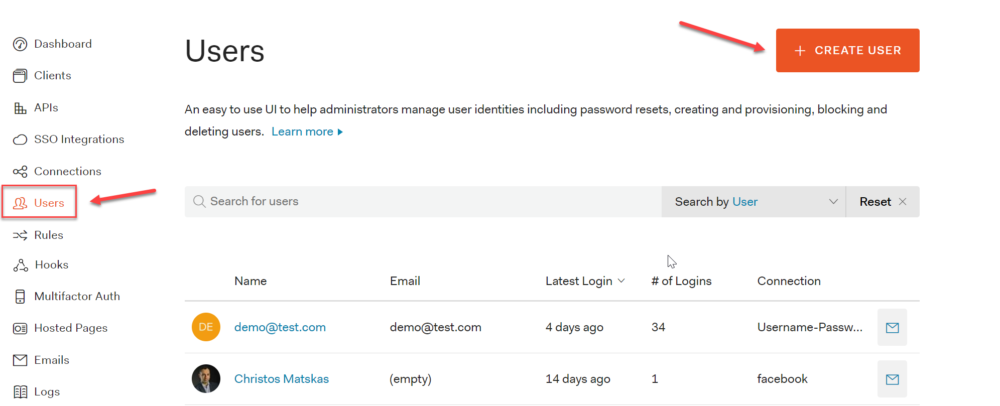

 You can use a real or a fictional account and you **don't have to verify the email** in order to use the newly created account for the purpose of this demo:

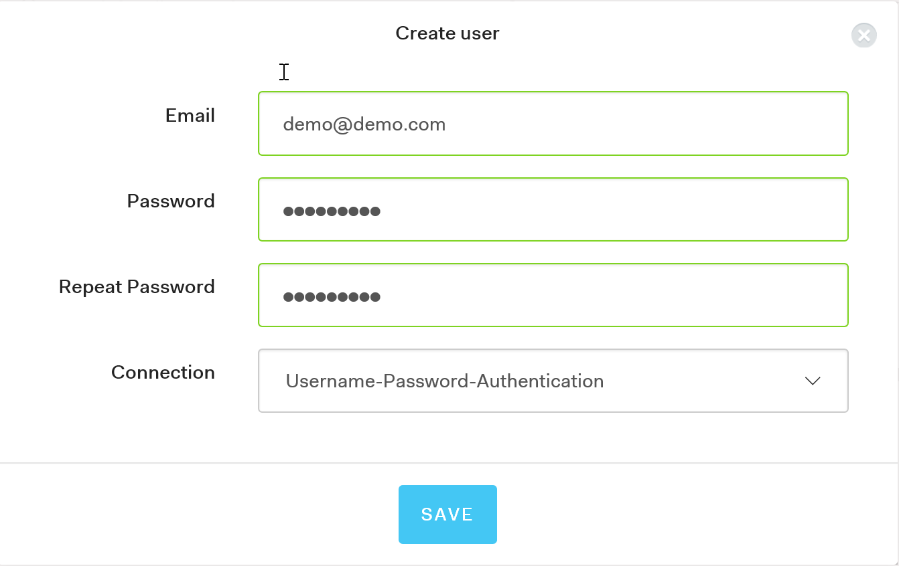

Once the user is created successfully, we need to add some extra metadata that can be used later to determine the user's role. The metadata can be anything that makes sense to your organization. For this example I decided to use the **job** property. Open the newly created user, scroll down to **metadata** and add the json metadata as per the picture below:

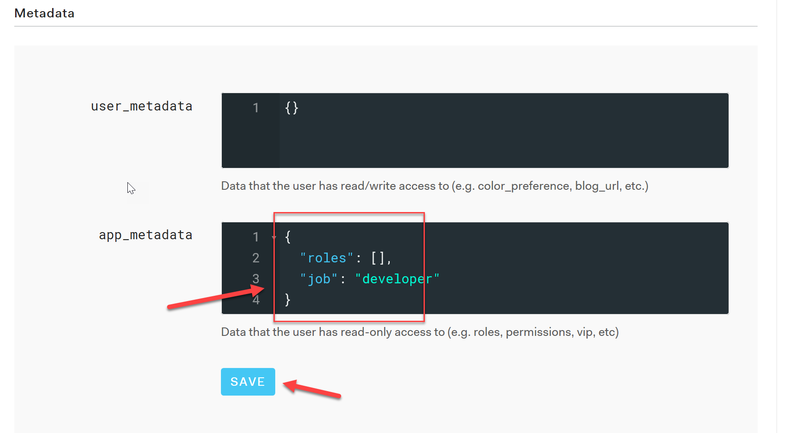

Make sure you press the **Save** button to persist the changes. Now we can create an **Auth0 Rule** that determines the user's role during the authentication workflow. You can find more about Auth0 Rules [here](https://auth0.com/docs/rules/current).

On the Auth0 portal, on the **Dashboard** page, select **Rules** the left-hand side navigation bar. Press the **+Create New Rule** button. 

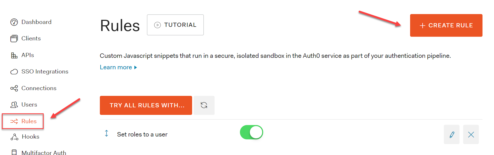

Select the **Add Roles to User** rule from the list of available options:

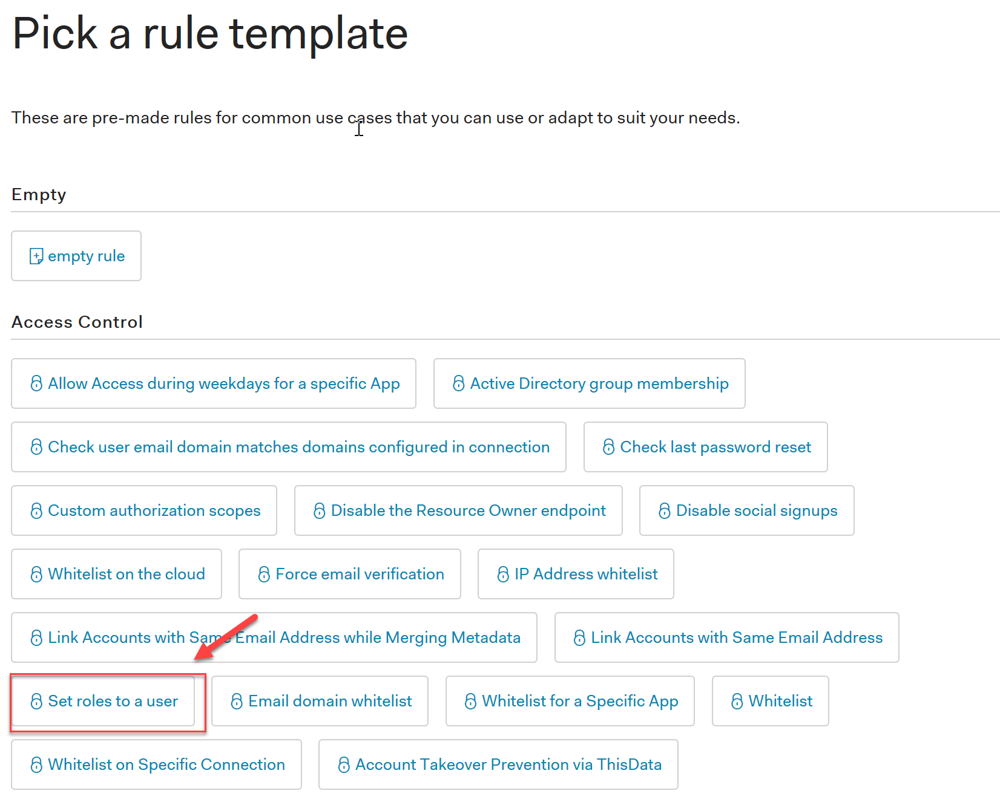

The rule editor allows developers to use JavaScript to implement the rule functionality. In this instance we look into the user's `app_metadata` to determing what role to assign to both the `access_token` and `id_token`.

Don't forget to save the new rule. 

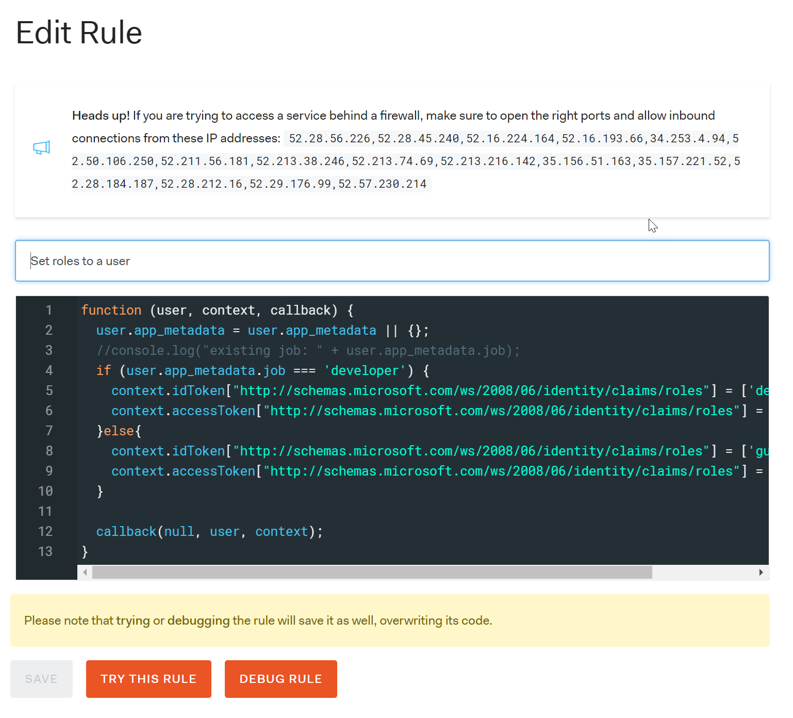

You can test the rule to see whether everything's working as expected. You can also use inline `console.log()` statements to output extra information to the test functionality, or you can stream the logs to a separate page that listens for debug/console statements. The full code of the rule is provided below: 

```
function (user, context, callback) {
  user.app_metadata = user.app_metadata || {};
  //console.log("existing job: " + user.app_metadata.job);
  if (user.app_metadata.job === 'developer') {
    context.idToken["http://schemas.microsoft.com/ws/2008/06/identity/claims/roles"] = ['developer'];
    context.accessToken["http://schemas.microsoft.com/ws/2008/06/identity/claims/roles"] = ['developer'];  
  }else{
    context.idToken["http://schemas.microsoft.com/ws/2008/06/identity/claims/roles"] = ['guest'];
    context.accessToken["http://schemas.microsoft.com/ws/2008/06/identity/claims/roles"] = ['guest'];
  }

  callback(null, user, context);
}
``` 

You'll notice that custom claims need to namespaced (using any url). This is mentioned in the Auth0 [documentation](https://auth0.com/docs/api-auth/tutorials/adoption/scope-custom-claims#custom-claims) and I've attached the excerpt below:

> We can, however, define a non-standard claim by namespacing it through a rule: {example omitted}. 
Any non-Auth0 HTTP or HTTPS URL can be used as a namespace identifier, and any number of namespaces can be used. The namespace URL does not have to point to an actual resource, it’s only used as an identifier and will not be called by Auth0.

I've explicitly used the `http://schemas.microsoft.com/ws/2008/06/identity/claims/roles` namespace because this is what the [ASP.NET Core Identity](https://docs.microsoft.com/en-us/dotnet/api/microsoft.aspnetcore.identity?view=aspnetcore-2.0) object maps to by default. I'm also assigning the role to both the `id_token` and `access_token` because the `id_token` is used by the MVC application and the `access_token` is sent to the API. Without these claims in the `access_token`, it wouldn't be possible to propagate the urer role(s) to the API.

To enforce authentication on any controller or controller action, we can apply the `[Authorize]` attribute. If you want to understand how Authorization works in ASP.NET Core, you can find the details in the [official documentation](https://docs.microsoft.com/en-us/aspnet/core/mvc/controllers/filters#authorization-filters). 

We can now run and test the application! If everything's been configured correctly then clicking on the login page, should redirect you to Auth0's login page which looks like this:

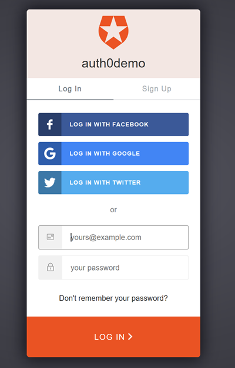 

## Add Authentication and Authorization to the API
The final piece of the puzzle requires that we configure the authentication and authorization middleware in our API. Open the `Startup.cs` file in the API project and add the following code:

```
public void ConfigureServices(IServiceCollection services)
{
    string domain = $"https://{Configuration["Auth0:Domain"]}/";
    services.AddAuthentication(options =>
    {
        options.DefaultAuthenticateScheme = JwtBearerDefaults.AuthenticationScheme;
        options.DefaultChallengeScheme = JwtBearerDefaults.AuthenticationScheme;
    }).AddJwtBearer(options =>
    {
        options.Authority = domain;
        options.Audience = Configuration["Auth0:ApiIdentifier"];
        options.TokenValidationParameters = new TokenValidationParameters
        {
            RoleClaimType = "http://schemas.microsoft.com/ws/2008/06/identity/claims/roles"
        };
    });

    services.AddMvc();
}

// This method gets called by the runtime. Use this method to configure the HTTP request pipeline.
public void Configure(IApplicationBuilder app, IHostingEnvironment env)
{
    if (env.IsDevelopment())
    {
        app.UseDeveloperExceptionPage();
    }

    app.UseAuthentication();

    app.UseMvc();
}
```

The code above adds the necessary authentication middleware that validates the `access_token` and retrieves the token claims and roles. We also need to add the Auth0 settings in the `appsettings.json` file. The configuration settings are provided below:

```
"Auth0": {
    "Domain": "{yourAuthDomain}.eu.auth0.com",
    "ApiIdentifier": "{your API Identifier}"
}
```

The middleware code allows us to apply the `[Authorize]` attributes to controllers and controller actions and use role-based authorization like in the example below:

```
[HttpGet]
[Authorize(Roles = "admin,developer,guest")]
public IActionResult Get()
{
    // execute some code
}

[HttpGet("{id}")]
[Authorize(Roles = "admin,developer,guest")]
public string Get(int id)
{
    // execute some code
}

// POST api/values
[HttpPost]
[Authorize(Roles = "admin,developer")]
public void Post([FromBody] Payload payload)
{
    // execute some code
}

// PUT api/values/5
[HttpPut]
[Authorize(Roles = "admin,developer")]
public void Put([FromBody] Payload payload)
{
    // execute some code
}

// DELETE api/values/5
[HttpDelete("{id}")]
[Authorize(Roles = "admin")]
public void Delete(int id)
{
    // execute some code
}
```

In this example, users with the **guest** role can only execute `GET` actions. Those with the **developer** role can execute `GET, POST, PUT` actions and those with an **admin** role can execute all of the above, plus `DELETE`. 

## Adding Refresh Tokens for mobile applications

The web application uses the `id_token` to access the user's profile while the `access_token` is used to make authenticated calls to the WebAPI. A **Refresh Token** allows an application to request a new access_token or id_token directly from Auth0, without having to re-authenticate the user. This will work as long as the Refresh Token has not been revoked or expired. Refresh tokens can also expire but they're rather long-lived.

To configure the `refresh_token`, in the Auth0 dashboard, select **APIs** from the left-hand navigation bar and then the **Settings** tab. 

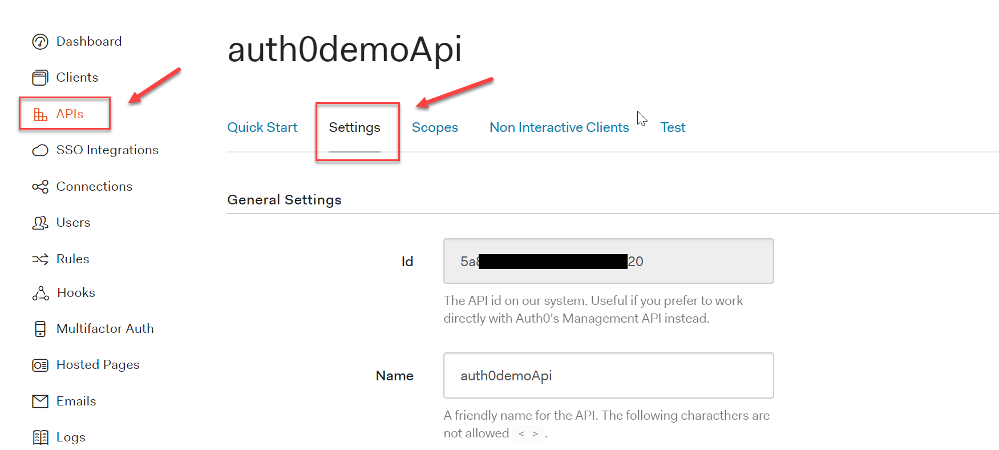

Scroll down to the bottom of the settings and toggle the **Offline Access** to on/true

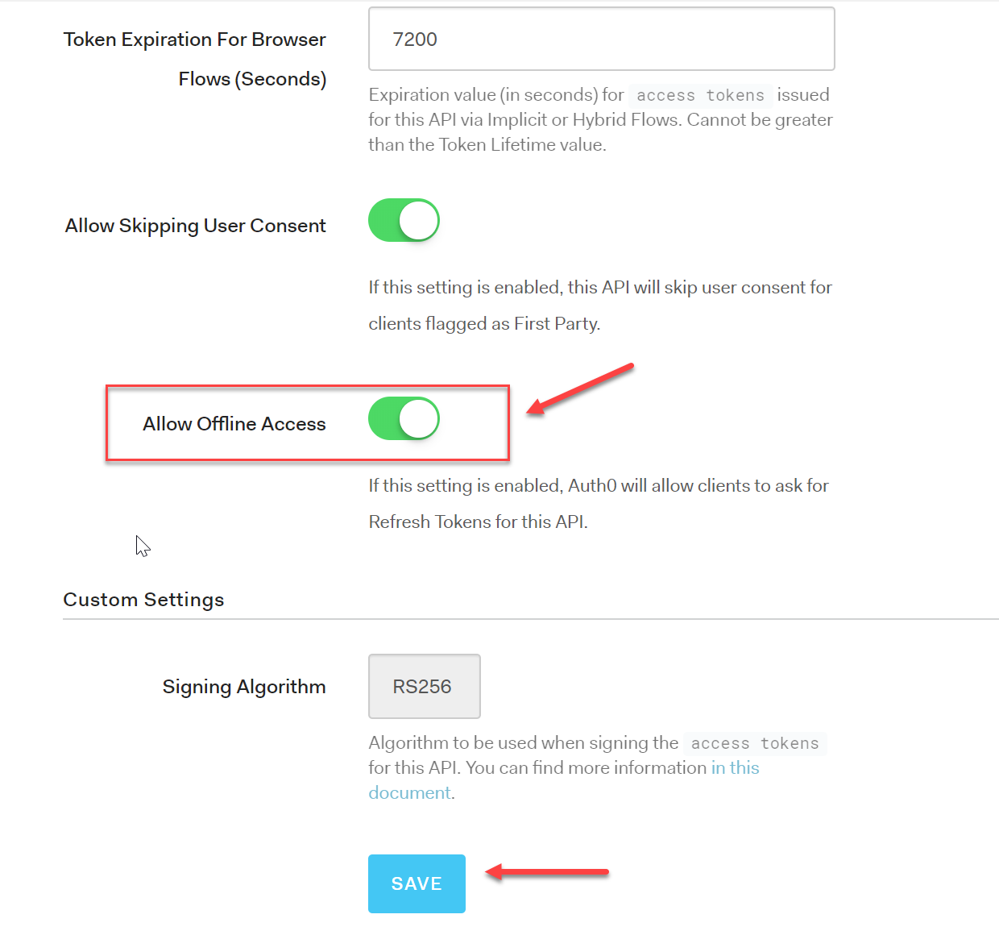

With this setting on, we can request for a Refresh token during the first authentication by including the `offline_access` scope. That's all you need. The Offline Access toggle in your API settings set to true and the extra scope in the authentication request. 

In your application (assuming it's a .NET Core Web Application) you can add the new scope in the authentication middleware:

```
public void ConfigureServices(IServiceCollection services)
{
    //other code omitted for clarity		
    options.Scope.Clear();
    options.Scope.Add("openid");
    options.Scope.Add("profile");
    options.Scope.Add("offline_access");
    options.SaveTokens = true;
    // rest of code omitted for clarity
}
```
Upon the first subsequent login, you'll notice that we need to approve the extra scope for **Offline Access**:

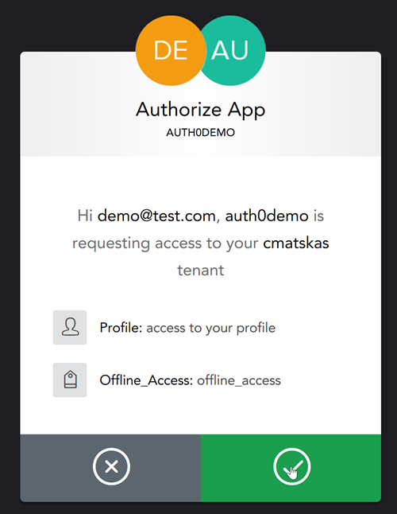

Once logged in successfully, we access the Refresh Token using the following code:

`var refreshToken = await HttpContext.GetTokenAsync("refresh_token");`

There's also a very good example that shows how to use Auth0 and Refresh Tokens in a Xamarin mobile application [here](https://github.com/auth0-community/auth0-xamarin-oidc-samples/blob/master/Quickstart/01-Login/iOS/iOSSample/MyViewController.cs).

